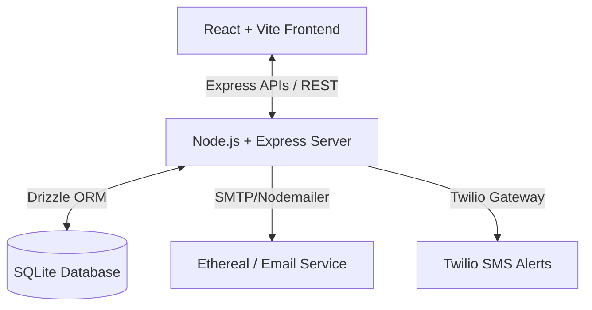

# ⚡ QueueLess — Smart Queue Management System for Banks

[](https://render.com/deploy?repo=https://github.com/Durga0610/Smart-queue-Management-System-for-Bank)
[](https://github.com/Durga0610/Smart-queue-Management-System-for-Bank/actions)
[](https://opensource.org/licenses/MIT)

QueueLess is an advanced, production-grade full-stack queue optimization and branch booking application built for modern bank branches. It minimizes lobby overcrowding, eliminates waiting times, rewards good booking behaviors with karma ratings, and introduces an innovative marketplace for peer-to-peer queue slot swapping.

---

## 🌟 Core Features

### 📅 Smart Token Generation & Booking
* **Dynamic Time Slots**: Schedule a branch visit dynamically based on real-time counter traffic and average processing durations.
* **Smart Priority Routing**: Auto-handles groups and prioritizes senior citizens, disabled individuals, or premium account holders.

### 📋 Service-Specific Checklists
* **Document Verification**: Each bank service (e.g., Account Opening, Loan Verification, Safe Deposit) has a dynamic checklist of required physical documents.
* **Pre-Arrival Readiness**: Ensures customers bring the right items, reducing transaction times at counters from 20 minutes to under 5 minutes.

### 🔄 P2P Ticket Swapping Marketplace
* **No Missed Appointments**: Can't make your time slot? List your ticket on the swap board.
* **Dynamic Matchmaking**: Other customers with later times can request a swap, optimizing the branch's daily schedule dynamically.

### 💎 Karma Point System
* **Behavior Rewards**: Users gain karma for arriving on time and checking off prerequisites, and lose karma for no-shows.
* **Queue Hygiene**: Higher-karma users get access to premium counters and fast-track priority slots.

### 📢 Automated Multi-Channel Notifications
* **SMTP Email Confirmations**: Professional pre-arrival instructions, booking slips, and dynamic transaction checklists delivered to inbox.
* **Twilio SMS Alerts**: Real-time SMS notifications for branch check-ins and counter queue number callouts.

---

## 🏗️ Technical Architecture & Design System

QueueLess is architected as an ultra-responsive monorepo utilizing a centralized Drizzle-ORM schema, Node.js backend, and a rich, fluid React frontend.



### Tech Stack
* **Frontend**: React (Vite, TypeScript, TailwindCSS, Framer Motion, Radix UI)
* **Backend**: Node.js, Express, TypeScript, Express Session
* **Database & ORM**: Drizzle ORM, SQLite (better-sqlite3)
* **APIs & Integration**: Nodemailer (SMTP), Twilio (SMS Notifications)
* **Workspace Manager**: PNPM Workspaces

---

## 🚀 One-Click Cloud Deployment (Render Blueprint)

QueueLess includes a custom `render.yaml` blueprint configuration for fully automated, 100% free hosting.

### Deploying to Render
1. Click the **Deploy to Render** button below:
   [](https://render.com/deploy?repo=https://github.com/Durga0610/Smart-queue-Management-System-for-Bank)
2. Connect your GitHub account.
3. Review the environment variables:
   * `NODE_ENV`: `production`
   * `DATABASE_URL`: `./sqlite.db`
4. Click **Apply**! Render will automatically install the PNPM workspace, compile the production bundles, push the database schema migrations, and host the active backend and frontend unified on a single port.

---

## 💻 Local Development Setup

To run QueueLess locally on your developer workstation:

### Prerequisites
* [Node.js](https://nodejs.org/) (v20+ recommended)
* [pnpm](https://pnpm.io/) (`npm install -g pnpm`)

### Installation & Run Steps
1. **Clone the repository**:
   ```bash
   git clone https://github.com/Durga0610/Smart-queue-Management-System-for-Bank.git
   cd Smart-queue-Management-System-for-Bank
   ```
2. **Install Workspace Dependencies**:
   ```bash
   pnpm install
   ```
3. **Initialize Database Schema**:
   ```bash
   pnpm db:push
   ```
4. **Configure Environment Variables**:
   Create a `.env` file in `./Unique-Finance-Tracker/` (refer to `.env.example`).
5. **Start Dev Server**:
   ```bash
   pnpm dev
   ```
   * Open your browser and navigate to `http://localhost:5173`.
